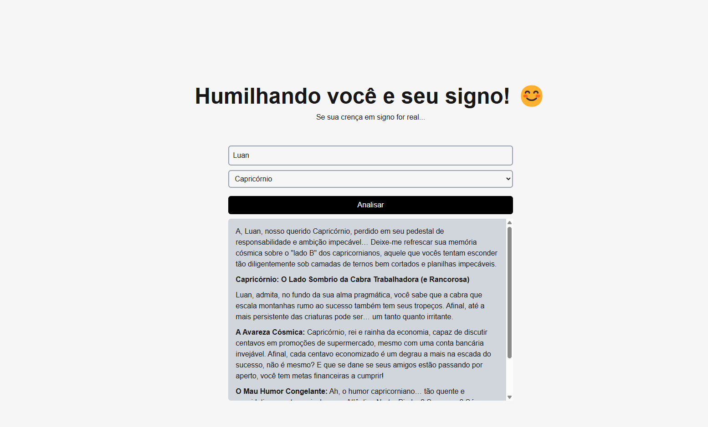

<h1 align='center'>Humilhador de Signos</h1>

<h1 align="center">
  
</h1>

## About 🚀

  A fun and satirical project that "roasts" each zodiac sign with witty and exaggerated descriptions. Built with Node.js and Fastify, this simple API returns a humorous insult based on the selected zodiac sign. Ideal for learning and having a laugh with friends. Not to be taken seriously – just astrology humor at its finest!
  
---

## Techs ✔
- [Next JS](https://nextjs.org/)
- [Open AI](https://openai.com/index/openai-api/)
- [TailwindCSS](https://tailwindcss.com/)
---

## [Live mode](https://humilhador-signos.vercel.app/) 🔗

## How to install 💻

```bash
#First clone this project on your preference path

$ git clone https://github.com/Luan4560/humilhador-signos

# Then got to you path, open the project and install the dependecies.

$ yarn or npm install

# After that, just initilialize the project with:

$ yarn dev
```
---